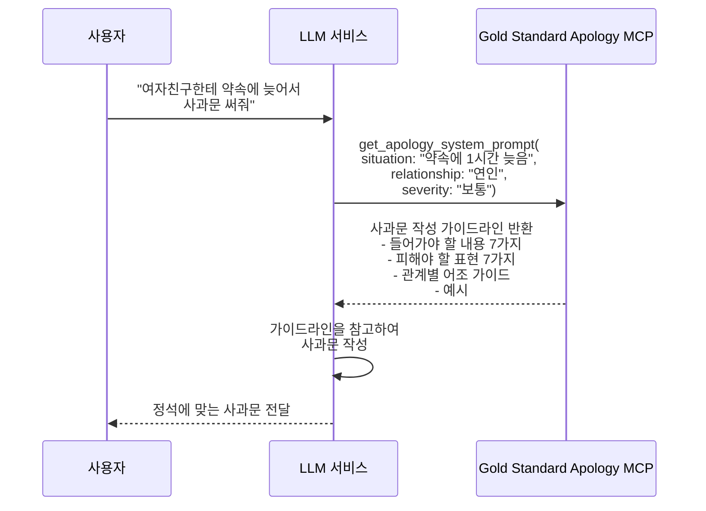

# Gold Standard Apology MCP

정석 사과문 작성을 도와주는 MCP(Model Context Protocol) 서버입니다.

## 개요

사용자가 사과문을 작성해야 할 상황에서, 상황 정보를 입력하면 정석적인 사과문 작성을 위한 가이드라인을 system prompt 형태로 반환합니다. LLM 서비스가 이 가이드라인을 참고하여 효과적인 사과문을 작성할 수 있도록 도와줍니다.

## 동작 방식



## 제공하는 Tool

### `get_apology_system_prompt`

상황에 맞는 사과문 작성 가이드라인을 생성합니다.

**파라미터:**

| 파라미터 | 타입 | 필수 | 설명 |
|---------|------|-----|------|
| `situation` | string | O | 사과해야 하는 상황에 대한 설명 |
| `relationship` | string | O | 사과 대상과의 관계 (연인, 친구, 부모님, 직장 상사, 고객 등) |
| `severity` | string | X | 상황의 심각도 (경미, 보통, 심각). 기본값: "보통" |

**반환값:**

```json
{
  "system_prompt": "사과문 작성 가이드라인...",
  "usage_guide": "위 가이드라인을 참고하여 상황에 맞는 진정성 있는 사과문을 작성해 주세요."
}
```
