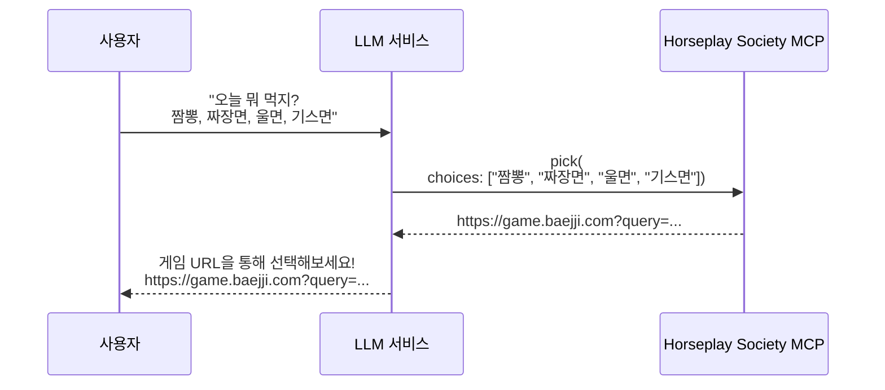

# Horseplay Society MCP

선택 장애를 해결해주는 MCP(Model Context Protocol) 서버입니다.

## 개요

여러 선택지 중 무엇을 선택해야 할지 고민될 때, 선택지를 입력하면 게임을 통해 결정할 수 있는 URL을 생성해줍니다.

## 동작 방식



## 제공하는 Tool

### `pick`

여러 선택지를 받아 게임 URL을 생성합니다.

**파라미터:**

| 파라미터 | 타입 | 필수 | 설명 |
|---------|------|-----|------|
| `choices` | list[str] | O | 선택지 목록 (예: ["짬뽕", "짜장면", "울면", "기스면"]) |

**반환값:**

선택지가 인코딩된 게임 URL을 반환합니다.

```
https://game.baejji.com?query={base64_encoded_choices}
```

## 사용 예시

- 오늘 뭐 먹지? → 짬뽕, 짜장면, 울면, 기스면
- 주말에 뭐 할까? → 영화보기, 운동하기, 집에서 쉬기, 친구 만나기
- 누가 발표할까? → 철수, 영희, 민수

## 실행 방법

```bash
# 의존성 설치
pip install -r requirements.txt

# 서버 실행
python mcp_server.py
```

서버는 기본적으로 `http://0.0.0.0:8080`에서 실행됩니다.

### 엔드포인트

- `/health` - 헬스체크
- `/mcp` - MCP 서버 엔드포인트
