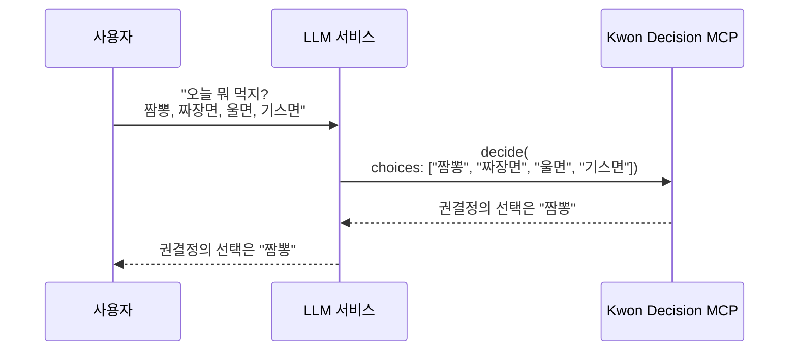

# Kwon Decision MCP

선택 장애를 해결해주는 MCP(Model Context Protocol) 서버입니다.

## 개요

여러 선택지 중 무엇을 선택해야 할지 고민될 때, 선택지를 입력하면 권결정이 대신 결정해줍니다.

## 동작 방식



## 제공하는 Tool

### `decide`

여러 선택지 중 하나를 랜덤으로 선택해줍니다.

**파라미터:**

| 파라미터 | 타입 | 필수 | 설명 |
|---------|------|-----|------|
| `choices` | list[str] | O | 선택지 목록 (예: ["짬뽕", "짜장면", "울면", "기스면"]) |

**반환값:**

```
권결정의 선택은 "선택된항목"
```

## 사용 예시

- 오늘 뭐 먹지? → 짬뽕, 짜장면, 울면, 기스면
- 주말에 뭐 할까? → 영화보기, 운동하기, 집에서 쉬기, 친구 만나기
- 어떤 색으로 할까? → 빨강, 파랑, 초록, 노랑
